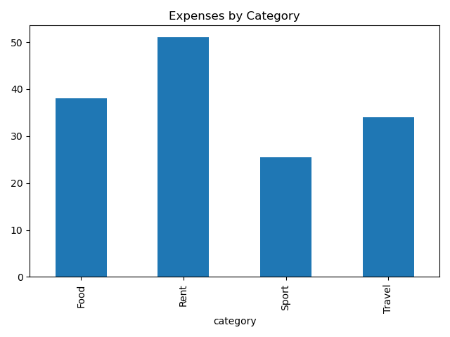
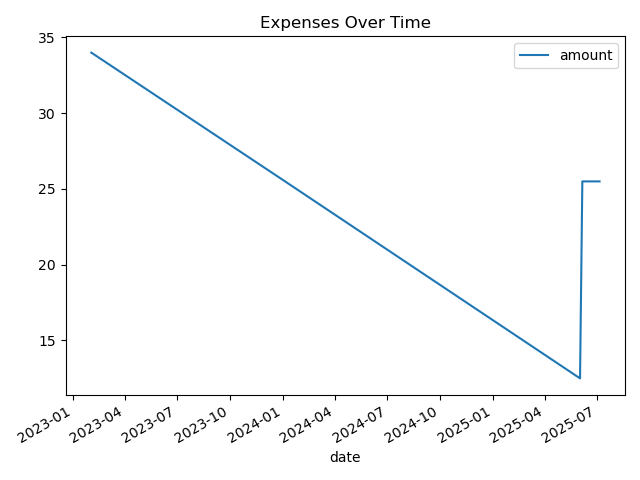

# Expense_tracker 

## app structure 
<pre lang="markdown">
expense_tracker/
│
├── expense.py        # The Expense class
├── storage.py        # store_expense() and load_expense()
├── report.py        # summarize and visualize
├── main.py          # main script that runs the app
└── expenses.csv      # expense data
</pre>

## plots

To do: 
<pre lang="markdown">
What do you want to do?
1. Add new expense
2. View total & category summary
3. View monthly/yearly summary
4. Show expense plot
5. Exit
</pre>
